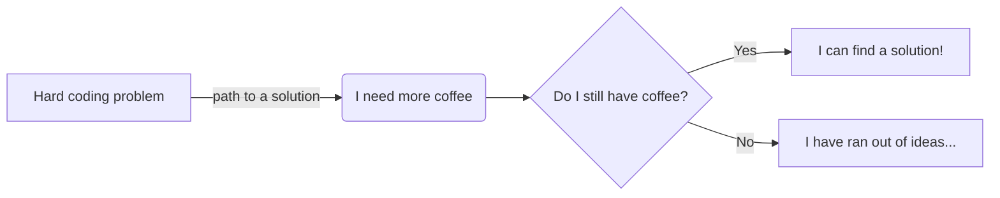

```bash
         ▄ .▄▄▄▄ .▄▄▌  ▄▄▌             ▄▄▄·  ▐ ▄ ·▄▄▄▄      ▄▄▌ ▐ ▄▌▄▄▄ .▄▄▌   ▄▄·       • ▌ ▄ ·. ▄▄▄ .▄▄ 
        ██▪▐█▀▄.▀·██•  ██•  ▪         ▐█ ▀█ •█▌▐███▪ ██     ██· █▌▐█▀▄.▀·██•  ▐█ ▌▪▪     ·██ ▐███▪▀▄.▀·██▌
        ██▀▐█▐▀▀▪▄██▪  ██▪   ▄█▀▄     ▄█▀▀█ ▐█▐▐▌▐█· ▐█▌    ██▪▐█▐▐▌▐▀▀▪▄██▪  ██ ▄▄ ▄█▀▄ ▐█ ▌▐▌▐█·▐▀▀▪▄▐█·
        ██▌▐▀▐█▄▄▌▐█▌▐▌▐█▌▐▌▐█▌.▐▌    ▐█ ▪▐▌██▐█▌██. ██     ▐█▌██▐█▌▐█▄▄▌▐█▌▐▌▐███▌▐█▌.▐▌██ ██▌▐█▌▐█▄▄▌.▀ 
        ▀▀▀ · ▀▀▀ .▀▀▀ .▀▀▀  ▀█▄▀▪     ▀  ▀ ▀▀ █▪▀▀▀▀▀•      ▀▀▀▀ ▀▪ ▀▀▀ .▀▀▀ ·▀▀▀  ▀█▄▀▪▀▀  █▪▀▀▀ ▀▀▀  ▀ 
```

<p align="right">
    <a href="https://www.linkedin.com/in/paolofabiozaino/"></a>
    <a href="https://twitter.com/PaoloFabioZaino"></a>
    <a href="https://www.instagram.com/paolofabiozaino/"></a>
<!--
[](https://www.facebook.com/Paolo-Fabio-Zaino-104703188259807)
-->
<!--
[](https://youtube.com/channel/UCOaGksYHwlmVPKghnWN-duw)
-->
</p>

### Hi there 👋

- 🔭 I’m currently working on a lot of stuff! From Kernel development on Linux and on different Architectures, to write tech blogs, to enjoy coding random stuff, improve my personal automation and more.
- 🌱 I’m currently learning Machine Learning (yup funny choice of words, I know!) to apply it to Cyber Security and a bunch of other stuff
- 👯 I’m looking to collaborate on whatever, as long as it has a "C" involved (C, C++, C#), maybe an "A" (ASM) or an "R" (Rust). You'll find me mostly on the [RISC OS Community](https://github.com/RISC-OS-Community) or on my [ZFP Systems](https://github.com/ZFPSystems) organizations.
- 🤔 I’m looking for help with finishing my many many projects!
- 💬 Ask me about Assembly, c'mon I know you want to know more about it!
- 📫 How to reach me: [Contact Me](https://paolozaino.wordpress.com/contact/)
- 😄 Pronouns: he/him
- ⚡ Fun fact: Apparently, the first computer virus was created in 1986, the same year I started coding. Now, before you jump to conclusions, I wasn't involved at all, I swear! 😄

[Check out my blog if you want to read some of my tutorials and more (Linux, macOS, BSD, RISC OS, Retrocoding and Retrocomputing... oh and some cybersecurity stuff too!)](https://paolozaino.wordpress.com/)

### My stats

<details>
    <summary>Click here for my most used Programming Languages list and stats!</summary>
    <p align="center">
        
    </p>
</details>

<details>
    <summary>Click here for My GitHub Stats!</summary>
    <p align="center">
         
        <br>
    </p>
</details>

### Typical coding day



### Contributions Streak

I love Open Source :)

<p align="center"></p>

### My scores

Fun stuff for the boring days!

<p align="center"> <a href="https://github.com/ryo-ma/github-profile-trophy"></a></p>

<h3 align="left">Some of the Languages and Tools I play/played with:</h3>
<p align="left">
         <a href="https://www.arduino.cc/" target="_blank" rel="noreferrer">  </a> 
         <a href="https://aws.amazon.com" target="_blank" rel="noreferrer">  </a>
         <a href="https://www.gnu.org/software/bash/" target="_blank" rel="noreferrer">  </a>
         <a href="https://www.cprogramming.com/" target="_blank" rel="noreferrer">  </a> 
         <a href="https://www.w3schools.com/cpp/" target="_blank" rel="noreferrer">  </a> 
         <a href="https://www.w3schools.com/cs/" target="_blank" rel="noreferrer">  </a> 
         <a href="https://d3js.org/" target="_blank" rel="noreferrer">  </a>
         <a href="https://www.docker.com/" target="_blank" rel="noreferrer">  </a> 
         <a href="https://git-scm.com/" target="_blank" rel="noreferrer">  </a>
         <a href="https://developer.mozilla.org/en-US/docs/Web/JavaScript" target="_blank" rel="noreferrer">  </a>
         <a href="https://www.python.org" target="_blank" rel="noreferrer">  </a>
         <a href="https://golang.org" target="_blank" rel="noreferrer">  </a> 
         <a href="https://www.linux.org/" target="_blank" rel="noreferrer">  </a> 
         <a href="https://www.mongodb.com/" target="_blank" rel="noreferrer">  </a> 
         <a href="https://www.microsoft.com/en-us/sql-server" target="_blank" rel="noreferrer">  </a>
         <a href="https://www.mysql.com/" target="_blank" rel="noreferrer">  </a> 
         <a href="https://www.postgresql.org" target="_blank" rel="noreferrer">  </a>
         <a href="https://redis.io" target="_blank" rel="noreferrer">  </a> 
         <a href="https://www.rust-lang.org" target="_blank" rel="noreferrer">  </a> 
         <a href="https://www.sqlite.org/" target="_blank" rel="noreferrer">  </a>
         <a href="https://www.vagrantup.com/" target="_blank" rel="noreferrer">  </a> 
</p>

<!--
<p></p>

<p>&nbsp;</p>
//-->

Get my Feeds at:&nbsp;<a href="https://paolozaino.wordpress.com/feed/" target="blank"></a>

### Some of my Blog posts
<!-- BLOG-POST-LIST:START -->
- [C programming: How to return a complex object from a function like we can do in Golang and Rust](https://paolozaino.wordpress.com/2023/07/08/c-programming-how-to-return-a-complex-object-from-a-function-like-we-can-do-in-golang-and-rust/)
- [RISC OS: Iyonix PC Memory](https://paolozaino.wordpress.com/2023/04/18/risc-os-iyonix-pc-memory/)
- [Hardware: CPU Architecture classification](https://paolozaino.wordpress.com/2023/03/19/hardware-cpu-architecture-classification/)
- [Retrocomputing: How to build a Raspberry Pi Server to share files with retro or vintage systems and modern platforms | part 1](https://paolozaino.wordpress.com/2023/03/07/retrocomputing-how-to-build-a-raspberry-pi-server-to-share-files-with-retro-or-vintage-systems-and-modern-platforms-part-1/)
<!-- BLOG-POST-LIST:END -->

### My favorite Programming Languages

For work I do not mind really, whatever is fine, at work is the project that truly matters and the customers.

For my free time and fun, I like to play with (from favorite on the left to less favorite on the right):

<p align="left">
    
    
    
    
    
    <p align="right">
        <a href="https://github.com/pzaino"></a>
    </p>
    <!--
    <p align="right"> 
        <a href="https://github.com/pzaino"></a> 
    </p>
    //-->
</p>
