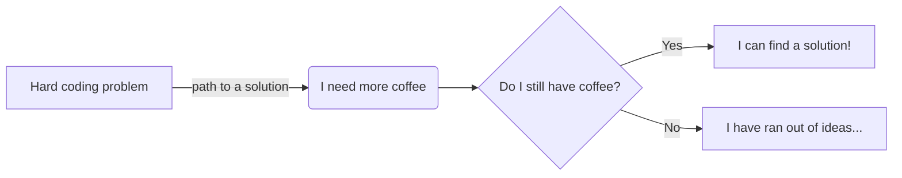

```
         ▄ .▄▄▄▄ .▄▄▌  ▄▄▌             ▄▄▄·  ▐ ▄ ·▄▄▄▄      ▄▄▌ ▐ ▄▌▄▄▄ .▄▄▌   ▄▄·       • ▌ ▄ ·. ▄▄▄ .▄▄ 
        ██▪▐█▀▄.▀·██•  ██•  ▪         ▐█ ▀█ •█▌▐███▪ ██     ██· █▌▐█▀▄.▀·██•  ▐█ ▌▪▪     ·██ ▐███▪▀▄.▀·██▌
        ██▀▐█▐▀▀▪▄██▪  ██▪   ▄█▀▄     ▄█▀▀█ ▐█▐▐▌▐█· ▐█▌    ██▪▐█▐▐▌▐▀▀▪▄██▪  ██ ▄▄ ▄█▀▄ ▐█ ▌▐▌▐█·▐▀▀▪▄▐█·
        ██▌▐▀▐█▄▄▌▐█▌▐▌▐█▌▐▌▐█▌.▐▌    ▐█ ▪▐▌██▐█▌██. ██     ▐█▌██▐█▌▐█▄▄▌▐█▌▐▌▐███▌▐█▌.▐▌██ ██▌▐█▌▐█▄▄▌.▀ 
        ▀▀▀ · ▀▀▀ .▀▀▀ .▀▀▀  ▀█▄▀▪     ▀  ▀ ▀▀ █▪▀▀▀▀▀•      ▀▀▀▀ ▀▪ ▀▀▀ .▀▀▀ ·▀▀▀  ▀█▄▀▪▀▀  █▪▀▀▀ ▀▀▀  ▀ 
```
<p align="right">
    <a href="https://www.linkedin.com/in/paolofabiozaino/"></a> 
    <a href="https://twitter.com/PaoloFabioZaino"></a> 
    <a href="https://www.instagram.com/paolofabiozaino/"></a> 
<!--
[](https://www.facebook.com/Paolo-Fabio-Zaino-104703188259807)
-->
<!--
[](https://youtube.com/channel/UCOaGksYHwlmVPKghnWN-duw)
-->
</p>

### Hi there 👋

- 🔭 I’m currently working on a lot of stuff! From Kernel development on Linux and on different Architectures, to write tech blogs, to enjoy coding random stuff, improve my personal automation and more.
- 🌱 I’m currently learning Machine Learning (yup funny choice of words, I know!) to apply it to Cyber Security and a bunch of other stuff
- 👯 I’m looking to collaborate on whatver, as long as it has a "C" involved (C, C++, C#), maybe an "A" (ASM) or an "R" (Rust). You'll find me mostly on the [RISC OS Community](https://github.com/RISC-OS-Community) or on my [ZFP Systems](https://github.com/ZFPSystems) organisations.
- 🤔 I’m looking for help with finishing my many many projects!
- 💬 Ask me about Assembly, c'mon I know you want to know more about it!
- 📫 How to reach me: https://paolozaino.wordpress.com/contact/
- 😄 Pronouns: he/him
- ⚡ Fun fact: Apparently, the first computer virus was created in 1986, the same year I started coding. Now, before you jump to conclusions, I wasn't involved at all, I swear! 😄

Check out my blog if you want to read some of my tutorials and more (Linux, macOS, BSD, RISC OS, Retrocoding and Retrocomputing... oh and some cybersecurity stuff too!): https://paolozaino.wordpress.com/

### My stats!

<details>
    <summary>Click here for my most used Programming Languages list and stats!</summary>
    <p align="center">
        
    </p>
</details>

<details>
    <summary>Click here for My GitHub Stats!</summary>
    <p align="center">
         
        <br>
    </p>
</details>

### Typical coding day



### Favourite Programming Languages

For work I do not mind really, whatever is fine, at work is the project that trully matters and the customers.

For my free time and fun, I like to play with (from favorite on the left to less favorite on the right):

<p align="left">
    
    
    
    
    
    <p align="right">
        <a href="https://github.com/pzaino"></a>
    </p>
</p>
